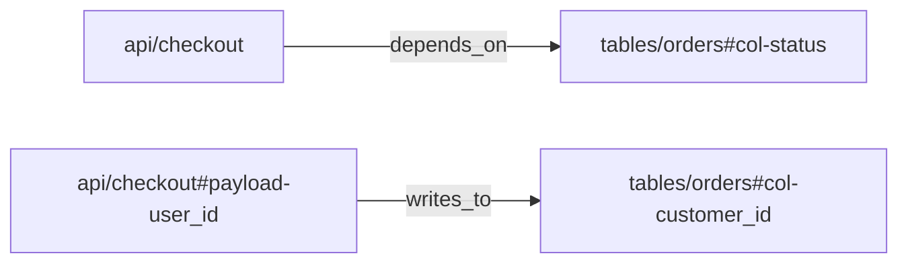

# okf

`okf` is a command-line toolkit for building, validating, analyzing, and
exporting
[Open Knowledge Format (OKF) v0.1](https://github.com/GoogleCloudPlatform/knowledge-catalog/blob/main/okf/SPEC.md),
Google's open, human- and agent-friendly format for representing knowledge as a
directory of Markdown files with YAML frontmatter. The repository also exposes
a minimal-dependency Go library and a portable agent skill for OKF workflows.

The project provides three public surfaces:

1. `okf` command-line toolkit for working with OKF bundles.
2. Go library packages `github.com/skosovsky/okf/bundle`, `github.com/skosovsky/okf/validator`, and `github.com/skosovsky/okf/graph` for embedding OKF support in Go programs.
3. `open-knowledge-format` agent skill for consulting on, creating,
   converting, enriching, validating, and exporting OKF bundles.

Russian documentation: [README.ru.md](README.ru.md).

## Usage 1: Toolkit

Install the `okf` command:

```sh
go install github.com/skosovsky/okf/cmd/okf@latest
```

Check that it is available:

```sh
okf help
okf version
```

Common commands:

```sh
okf validate -path <bundle>       # Check base OKF v0.1 conformance
okf validate -path <bundle> --strict --check-links --check-orphans
okf info     <bundle>       # Print bundle summary
okf index    <bundle>       # Regenerate index.md files
okf graph    <bundle>       # Export Markdown links and YAML relations
okf graph    <bundle> -format mermaid
okf graph    <bundle> -format json-ld
okf graph    <bundle> -format ntriples
okf graph    <bundle> --dot # Print Graphviz DOT
okf parse    <file>         # Print one document's parsed structure
okf fmt      <file>         # Normalize one document to stdout
okf fmt      <file> -w      # Rewrite the file in place
```

Graph output formats:

- `okf graph <bundle>` prints the default text adjacency list.
- `okf graph <bundle> -format dot` prints Graphviz DOT. `--dot` remains a legacy alias for this format.
- `okf graph <bundle> -format mermaid` prints Mermaid flowchart syntax (`graph LR`) that can be pasted into Markdown code fences on platforms that render Mermaid. Broken internal links are rendered as dotted edges labeled `404`.
- `okf graph <bundle> -format json-ld` prints a JSON-LD document with `@context` and `@graph` for graph tooling and agent harnesses. Each concept is emitted as a `bundle:<id>` node with `@type: "okf:Concept"`. Internal links are emitted as `okf:Reference` objects with `target` and `exists`, so dangling internal links remain visible as `"exists": false`.
- `okf graph <bundle> -format ntriples` prints line-oriented RDF/N-Triples: one full-IRI fact per line for bulk load, shell processing, RDF tooling, and streaming graph pipelines.

Semantic relations add a second graph layer. Markdown links remain human
navigation and export as `okf:references`; YAML `relations` define strict
semantic dependencies for impact analysis:

```yaml
type: API Endpoint
schema:
  fields:
    - id: payload-user_id
      name: user_id
      relations:
        writes_to:
          - target: tables/orders#col-customer_id
relations:
  depends_on:
    - target: tables/orders#col-status
```

Relation targets are OKF concept refs, not Markdown paths: use
`tables/orders#col-status`, not `tables/orders.md#col-status`. Nested semantic
sources require an explicit `id` or `anchor`; display `name` is not inferred.
`okf validate --check-links` still checks Markdown links only. Graph export
preserves semantic edges even when the target concept is missing.

Relation ref grammar is `<concept-id>[#<fragment>]`. The concept id must match
the bundle concept id exactly, with no leading `/`, `./`, `../`, `.md` suffix,
external URI scheme, empty path segment, or surrounding whitespace. Fragments are
literal subresource ids: non-empty, no surrounding whitespace, no `#`, and no
ASCII control characters. Invalid examples include `/tables/orders.md`,
`tables/orders.md`, `#local-section`, `https://example.com/orders`,
`urn:orders`, `tables/orders#`, `tables/orders#col#status`, and
`tables/orders# col-status`.



```json
{"@id":"bundle:api/checkout#payload-user_id","@type":"okf:SubResource","is_part_of":{"@id":"bundle:api/checkout"},"writes_to":[{"@id":"bundle:tables/orders#col-customer_id","exists":true}]}
```

```text
<local:bundle:api%2Fcheckout#payload-user_id> <https://okf.io/ontology/v0.1#writes_to> <local:bundle:tables%2Forders#col-customer_id> .
```

For a successfully parsed validation invocation, `okf validate` returns a
non-zero exit status when the bundle has conformance errors, so it can be used
directly in CI. CLI usage or flag errors also return `1`, but do not print a
validation summary:

```sh
okf validate -path ./knowledge
```

Successful validation prints deterministic diagnostics and summary:

```text
Validating bundle: ./knowledge

---
Scanned 12 files.
Result: PASS (0 errors, 0 warnings, 0 info)
```

Findings are printed before the summary with `[ERROR]`, `[WARN]`, or `[INFO]`
severity labels.

### Validation Modes

`okf validate` is layered. The base conformance layer runs by default; optional
flags add advisory checks for review workflows.

| Mode | Enable with | Diagnostics | Exit status |
| --- | --- | --- | --- |
| Base conformance | default | `[ERROR]` for hard OKF v0.1 violations | `1` when any error exists |
| Strict guidance | `--strict` | `[WARN]` for recommended metadata and body conventions | still `0` unless base errors exist |
| Link graph | `--check-links` | `[INFO]` for missing files, `[WARN]` for missing anchors | still `0` unless base errors exist |
| Orphan coverage | `--check-orphans` | `[WARN]` for unlisted concepts, `[INFO]` for missing local indexes | still `0` unless base errors exist |

Exception: with `--check-orphans`, an empty non-root local `index.md` is treated
as an orphan-coverage surface and reports orphan warnings instead of an
empty-index structure error.

The base layer checks UTF-8, concept frontmatter blocks, non-empty string
`type`, reserved `index.md` and `log.md` structure, and forward-compatible
handling of unknown frontmatter keys, unknown `type` values, and future
`okf_version` values.

`--strict` checks recommended fields `title`, `description`, `tags`, and
`timestamp`; `tags` must be a YAML list of strings, and `timestamp` must parse
as RFC3339. It also checks conventional `# Citations`, `# Examples`, BigQuery
`# Schema`, and `index.md` entry descriptions. Missing `resource` is
intentionally not a warning; if `resource` is present, it should be a valid URI.

## Usage 2: Library

Add the package to a Go module:

```sh
go get github.com/skosovsky/okf
```

Import it:

```go
import (
	"github.com/skosovsky/okf/bundle"
	"github.com/skosovsky/okf/validator"
)
```

Validate a bundle:

```go
b, err := bundle.LoadBundle("./knowledge")
if err != nil {
	return err
}

report := validator.ValidateBundle(b, &validator.ValidatorConfig{
	Strict:       true,
	CheckLinks:   true,
	CheckOrphans: true,
})
if !report.IsConformant() {
	for _, diagnostic := range report.Of(validator.SeverityError) {
		fmt.Println(diagnostic)
	}
}
```

Parse one document:

```go
doc, err := bundle.ParseDocument(input)
if err != nil {
	return err
}

title, _ := doc.Frontmatter.Title()
links := doc.Links()
citations := doc.Citations()
```

Regenerate indexes from Go:

```go
written, err := bundle.RegenerateIndexes("./knowledge")
if err != nil {
	return err
}

fmt.Println(written)
```

## Usage 3: Agent Skill

This repository ships a universal, Russian-language skill at
`skills/open-knowledge-format`. Use it when an agent needs to:

- explain or consult on OKF concepts and conformance rules;
- design a new OKF bundle;
- convert existing Markdown, Notion, Obsidian, CSV, or spreadsheet material to OKF;
- enrich existing OKF concepts with warranted metadata, schema sections, examples,
  citations, cross-links, indexes, and logs;
- validate an OKF bundle through the OKF CLI from the Go module;
- extract graph output for impact analysis and agent harnesses.

For runtimes that support local skills, register or copy the directory
`skills/open-knowledge-format` under the skill name `open-knowledge-format`.
The skill is intentionally not provider-specific; it contains portable Markdown
instructions and references.

For Codex plugin installation from this repository, use the included plugin
manifest at `.codex-plugin/plugin.json` and repo-local marketplace manifest at
`.agents/plugins/marketplace.json`:

```sh
codex plugin marketplace add .
codex plugin add okf@okf-local
```

After installation, start a new Codex session and ask it to use
`$open-knowledge-format`.

For Claude Code plugin installation from GitHub, use the included Claude plugin
manifest at `.claude-plugin/plugin.json` and marketplace manifest at
`.claude-plugin/marketplace.json`:

```text
/plugin marketplace add skosovsky/okf
/plugin install okf@okf
/reload-plugins
```

After installation, invoke `/okf:open-knowledge-format` or let Claude Code use
the skill automatically when the task matches OKF.

Use the Go module command for the quality gate:

```sh
go run github.com/skosovsky/okf/cmd/okf@latest validate -path <bundle>
```

The same CLI also supports summary, index generation, graph export, parsing,
and formatting:

```sh
go run github.com/skosovsky/okf/cmd/okf@latest validate -path <bundle>
go run github.com/skosovsky/okf/cmd/okf@latest info <bundle>
go run github.com/skosovsky/okf/cmd/okf@latest index <bundle>
go run github.com/skosovsky/okf/cmd/okf@latest graph <bundle>
go run github.com/skosovsky/okf/cmd/okf@latest graph <bundle> -format mermaid
go run github.com/skosovsky/okf/cmd/okf@latest graph <bundle> -format json-ld
go run github.com/skosovsky/okf/cmd/okf@latest graph <bundle> -format ntriples
```

If `okf` is already installed, `okf validate -path <bundle>` is equivalent.

## OKF Document

```markdown
---
type: BigQuery Table
title: Orders
description: One row per completed customer order.
tags: [sales, orders]
timestamp: 2026-05-28T00:00:00Z
---

# Schema

Part of the [sales dataset](/datasets/sales.md).

# Citations

[1] [Runbook](https://example.com/runbook)
```

## What It Supports

- Markdown documents with YAML frontmatter.
- Concept ID validation and path mapping.
- Bundle loading from a directory tree.
- Markdown link extraction and citation parsing.
- Graph output for Markdown links and YAML semantic relations.
- Backlinks and broken-link reporting.
- OKF v0.1 conformance validation.
- Deterministic `index.md` generation.
- `log.md` parsing and rendering.

## Validation

Conformance validation follows the OKF v0.1 format rules and deliberately keeps
semantic judgment out of the Go validation layer. Claim discovery, type
representativeness, writing style, content generation, and link repair remain
agent or policy work, not base conformance.

Use the default mode for CI conformance gates. Add `--strict`,
`--check-links`, and `--check-orphans` for review workflows where warnings and
informational diagnostics should be visible but should not reject the bundle.

## Development

Run tests:

```sh
go test ./...
```

Check coverage:

```sh
go test -coverprofile=/tmp/okf-cover.out ./...
go tool cover -func=/tmp/okf-cover.out
```
