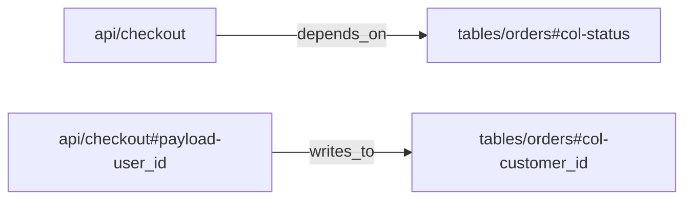

# okf

`okf` is a command-line toolkit for building, validating, analyzing, and
exporting
[Open Knowledge Format (OKF) v0.1](https://github.com/GoogleCloudPlatform/knowledge-catalog/blob/main/okf/SPEC.md),
Google's open, human- and agent-friendly format for representing knowledge as a
directory of Markdown files with YAML frontmatter. The repository also exposes
a minimal-dependency Go library and a portable agent skill for OKF workflows.

The project provides four public surfaces:

1. `okf` command-line toolkit for working with OKF bundles.
2. Go library packages `github.com/skosovsky/okf/bundle`, `github.com/skosovsky/okf/validator`, `github.com/skosovsky/okf/graph`, `github.com/skosovsky/okf/store`, and `github.com/skosovsky/okf/store/fs` for embedding OKF support and transactional mutations in Go programs.
3. `okf-mcp` stdio MCP server for agent clients that should inspect,
   validate, graph, and safely edit local OKF bundles through tools.
4. `open-knowledge-format` agent skill for consulting on, creating,
   converting, enriching, validating, and exporting OKF bundles.

Russian documentation: [README.ru.md](README.ru.md).

## Usage 1: Toolkit

Install the `okf` command:

```sh
go install github.com/skosovsky/okf/cmd/okf@latest
```

Check that it is available:

```sh
okf help
okf version
```

Common commands:

```sh
okf validate -path <bundle>       # Check base OKF v0.1 conformance
okf validate -path <bundle> --strict --check-links --check-orphans
okf info     <bundle>       # Print bundle summary
okf index    <bundle>       # Regenerate index.md files
okf graph    <bundle>       # Export Markdown links and YAML relations
okf graph    <bundle> -format mermaid
okf graph    <bundle> -format json-ld
okf graph    <bundle> -format ntriples
okf graph    <bundle> --dot # Print Graphviz DOT
okf parse    <file>         # Print one document's parsed structure
okf fmt      <file>         # Normalize one document to stdout
okf fmt      <file> -w      # Rewrite the file in place
```

Graph output formats:

- `okf graph <bundle>` prints the default text adjacency list.
- `okf graph <bundle> -format dot` prints Graphviz DOT. `--dot` remains a legacy alias for this format.
- `okf graph <bundle> -format mermaid` prints Mermaid flowchart syntax (`graph LR`) that can be pasted into Markdown code fences on platforms that render Mermaid. Broken internal links are rendered as dotted edges labeled `404`.
- `okf graph <bundle> -format json-ld` prints a JSON-LD document with `@context` and `@graph` for graph tooling and agent harnesses. Each concept is emitted as a `bundle:<id>` node with `@type: "okf:Concept"`. Internal links are emitted as `okf:Reference` objects with `target` and `exists`, so dangling internal links remain visible as `"exists": false`.
- `okf graph <bundle> -format ntriples` prints line-oriented RDF/N-Triples: one full-IRI fact per line for bulk load, shell processing, RDF tooling, and streaming graph pipelines.

Semantic relations add a second graph layer. Markdown links remain human
navigation and export as `okf:references`; YAML `relations` define strict
semantic dependencies for impact analysis:

```yaml
type: API Endpoint
schema:
  fields:
    - id: payload-user_id
      name: user_id
      relations:
        writes_to:
          - target: tables/orders#col-customer_id
relations:
  depends_on:
    - target: tables/orders#col-status
```

Relation targets are OKF concept refs, not Markdown paths: use
`tables/orders#col-status`, not `tables/orders.md#col-status`. Nested semantic
sources require an explicit `id` or `anchor`; display `name` is not inferred.
For a fragment target, `exists` is true only when both the concept and that
fragment exist and the fragment is unique.
Malformed or unresolved semantic relations remain structured diagnostics. The
default CLI and MCP validation reports cover base v0.1 conformance only; Go
callers may opt into relation policy with `ValidatorConfig.CheckRelations`.
Mutation and write paths still reject blocking relation diagnostics. They are excluded from
resolved outgoing, incoming, and reverse indexes and from all semantic graph
exporters. Non-canonical anchor aliases are informational only. This is
separate from dangling Markdown links: they remain navigation data and may be
rendered as missing.

Relation ref grammar is `<concept-id>[#<fragment>]`. The concept id must match
the bundle concept id exactly, with no leading `/`, `./`, `../`, `.md` suffix,
external URI scheme, empty path segment, or surrounding whitespace. Fragments are
literal subresource ids: non-empty, no surrounding whitespace, no `#`, and no
ASCII control characters. Invalid examples include `/tables/orders.md`,
`tables/orders.md`, `#local-section`, `https://example.com/orders`,
`urn:orders`, `tables/orders#`, `tables/orders#col#status`, and
`tables/orders# col-status`.


```mermaid
graph LR
  n0["api/checkout"] -->|"depends_on"| n1["tables/orders#col-status"]
  n2["api/checkout#payload-user_id"] -->|"writes_to"| n3["tables/orders#col-customer_id"]
```

```json
{"@id":"bundle:api/checkout#payload-user_id","@type":"okf:SubResource","is_part_of":{"@id":"bundle:api/checkout"},"writes_to":[{"@id":"bundle:tables/orders#col-customer_id","exists":true}]}
```

```text
<local:bundle:api%2Fcheckout#payload-user_id> <https://okf.io/ontology/v0.1#writes_to> <local:bundle:tables%2Forders#col-customer_id> .
```

For a successfully parsed validation invocation, `okf validate` returns a
non-zero exit status when the bundle has conformance errors, so it can be used
directly in CI. CLI usage or flag errors also return `1`, but do not print a
validation summary:

```sh
okf validate -path ./knowledge
```

Successful validation prints deterministic diagnostics and summary:

```text
Validating bundle: ./knowledge

---
Scanned 12 files.
Result: PASS (0 errors, 0 warnings, 0 info)
```

Findings are printed before the summary with `[ERROR]`, `[WARN]`, or `[INFO]`
severity labels.

### Validation Modes

`okf validate` is layered. The base conformance layer runs by default; optional
flags add advisory checks for review workflows.

| Mode | Enable with | Diagnostics | Exit status |
| --- | --- | --- | --- |
| Base conformance | default | `[ERROR]` for hard OKF v0.1 violations | `1` when any error exists |
| Strict guidance | `--strict` | `[WARN]` for recommended metadata and body conventions | still `0` unless base errors exist |
| Link graph | `--check-links` | `[INFO]` for missing files, `[WARN]` for missing anchors | still `0` unless base errors exist |
| Orphan coverage | `--check-orphans` | `[WARN]` for unlisted concepts, `[INFO]` for missing local indexes | still `0` unless base errors exist |

Exception: with `--check-orphans`, an empty non-root local `index.md` is treated
as an orphan-coverage surface and reports orphan warnings instead of an
empty-index structure error.

The base layer checks UTF-8, concept frontmatter blocks, non-empty string
`type`, reserved `index.md` and `log.md` structure, and forward-compatible
handling of unknown frontmatter keys, unknown `type` values, and future
`okf_version` values.

`--strict` checks recommended fields `title`, `description`, `tags`, and
`timestamp`; `tags` must be a YAML list of strings, and `timestamp` must parse
as RFC3339. It also checks conventional `# Citations`, `# Examples`, BigQuery
`# Schema`, and `index.md` entry descriptions. Missing `resource` is
intentionally not a warning; if `resource` is present, it should be a valid URI.

## Usage 2: Library

Add the package to a Go module:

```sh
go get github.com/skosovsky/okf
```

Import it:

```go
import (
	"github.com/skosovsky/okf/bundle"
	"github.com/skosovsky/okf/validator"
)
```

Validate a bundle:

```go
b, err := bundle.LoadBundle("./knowledge")
if err != nil {
	return err
}

report := validator.ValidateBundle(b, &validator.ValidatorConfig{
	Strict:       true,
	CheckLinks:   true,
	CheckOrphans: true,
})
if !report.IsConformant() {
	for _, diagnostic := range report.Of(validator.SeverityError) {
		fmt.Println(diagnostic)
	}
}
```

Parse one document:

```go
doc, err := bundle.ParseDocument(input)
if err != nil {
	return err
}

title, _ := doc.Frontmatter.Title()
links := doc.Links()
citations := doc.Citations()
```

Regenerate indexes from Go:

```go
written, err := bundle.RegenerateIndexes("./knowledge")
if err != nil {
	return err
}

fmt.Println(written)
```

### Transactional mutations

`store` provides immutable snapshots, previewable declarative changes, and CAS
commits. `store/fs` is the durable single-filesystem backend.

```go
package example

import (
	"context"
	"errors"
	"fmt"

	"github.com/skosovsky/okf/bundle"
	"github.com/skosovsky/okf/store"
	"github.com/skosovsky/okf/store/fs"
)

func update(ctx context.Context) (err error) {
	s, err := fs.Open("./knowledge", fs.DefaultConfig())
	if err != nil { return err }
	defer func() { if closeErr := s.Close(); closeErr != nil && err == nil { err = closeErr } }()
	base, err := s.Snapshot(ctx)
	if err != nil { return err }
	source, err := bundle.ParseRelationRef("api/orders")
	if err != nil { return err }
	target, err := bundle.ParseRelationRef("tables/orders")
	if err != nil { return err }
	change := store.ChangeSet{Version: store.ChangeSetFormatVersion, ID: "add-order-dependency", Actor: "agent", BaseRevision: base.Revision(), Operations: []store.Operation{store.EnsureRelation{Source: source, Type: "depends_on", Target: target}}}
	preview, err := s.Preview(ctx, change)
	if err != nil { return err }
	_ = preview
	_, err = s.Commit(ctx, change, store.CommitOptions{IdempotencyKey: "request-42"})
	var conflict *store.Conflict
	if errors.As(err, &conflict) { return fmt.Errorf("refresh and retry from %s", conflict.Actual) }
	return err
}
```

The operations express desired state: `EnsureRelation` makes one semantic edge
present exactly once; `MoveConcept` moves a concept and rewrites statically
resolvable canonical references; `RenameFragment` renames one explicit, unique
fragment and its incoming canonical references. A revision is an
algorithm-qualified digest of the canonical sorted manifest. The default is
`sha256:<lowercase-hex>`; `fs.Config.HashAlgorithm` can replace the algorithm.
`fs.Config` also bounds durable staged payloads: defaults are 256 MiB per
payload and 1 GiB per transaction; recovery rejects persisted manifests beyond
those limits before reading payload bytes.
Its visible set is every regular file below the bundle root, including
non-Markdown files and reserved index/log files, except `.okf/**`. Symlinks are
never read or hashed; the internal journal, receipts, and lease are excluded.
Journal v5 binds its algorithm, canonical request/result/replay data, and the
canonical base manifest used to distinguish safe crash recovery from editor drift in a
compact, bounded manifest; durable staged payloads hold post-state bytes.
Recovery verifies each payload's safe no-follow path, declared size, and
SHA-256 digest before apply, then cleans up the journal and stage. It requires
the same configured algorithm. The persisted receipt envelope is v2.
`Commit` compares `BaseRevision` under a cooperating-writer lease and returns a
structured `*store.Conflict` on CAS mismatch. `Commit` returns a
`store.CommitReceipt` and `ReplaceConcept` returns one in its result; both
replay the identical receipt for the same canonical request and idempotency
key. By default receipts remain for 24 hours and at
least the newest 1000 are retained.

Only nested mappings participate in the fragment namespace: top-level
frontmatter `id` and `anchor` remain concept metadata. For nested mappings,
`id` is the canonical fragment identity. A different
valid `anchor` is a noncanonical alias for information and navigation only;
semantic mutations and relation refs address the canonical `id`.

The filesystem backend is deliberately scoped: leases are advisory, so raw
editors do not participate; raw readers can observe a multi-rename commit while
it is being published. The journal provides recovery, not distributed
isolation. It covers one filesystem; distributed deployments need another
`store.Store` backend.

### Supported platforms

The durable `store/fs` backend is supported on Darwin and Linux. Those targets
use descriptor-relative no-follow traversal, advisory file leases, atomic
rename, file sync, directory sync, and journal recovery; runtime capability
checks may still reject a filesystem that cannot provide the required
guarantees.

Windows and other targets are compile-safe but are not durable-backend targets.
`fs.Open` and `fs.OpenContext` return `*fs.UnsupportedPlatformError`, which is
recognizable with `errors.Is(err, fs.ErrUnsupportedPlatform)` and inspectable
with `errors.As`. Backend-neutral packages (`bundle`, `graph`, `validator`,
`store`, and `mutation`) remain buildable there. See the
[release-engineering contract](docs/release-engineering.md) for the enforced CI
matrix and traceability policy.

### Lossless presentation contract

Mutation planning loads and validates the staged source once before a write; an
invalid or unsupported edit is never staged or written. Markdown destinations
use Goldmark as the semantic oracle and a separate exact byte-span collector.
Only the Markdown body is parsed (with body-only offsets mapped back to the
full file); inline links, images, and each reference definition are eligible.
Autolinks, raw-HTML `href`/URLs, code spans, fenced or indented code, and
unresolved or malformed references are not rewritten. A semantic Markdown
link or image inside an inline-HTML container is still eligible when Goldmark
emits an AST `Link` or `Image`. Reference uses never duplicate a definition
span; duplicate normalized definitions are Ambiguous. Escaped/entity source
tokens are compared as semantic destinations, and replacements preserve the
angle style or switch to a safely escaped angle destination when required.
No Markdown or YAML is re-rendered.

YAML mutations use `yaml.v3` as semantic authority and support only the proven
block-style subset of plain, single-quoted, and double-quoted touched scalar
keys and values.
Unsupported or ambiguous touched presentation includes flow mappings or
sequences; literal or folded block scalars; explicit or custom tags; direct
anchors or complex keys (Unsupported); alias/merge provenance and duplicate
semantic relations, types, targets, ids, or anchors (Ambiguous); other duplicate
touched mapping keys (Unsupported); directives `%YAML`/`%TAG`; inner document/end markers
or multi-document content within frontmatter; and comments or source ranges
that cannot be proved. Unrelated nonintersecting extension bytes may remain
losslessly. Invalid UTF-8 and these cases return typed errors, create no stage,
and are distinguishable with
`errors.Is(err, mutation.ErrUnsupportedPresentation)` or
`mutation.ErrAmbiguousPresentation`; they fail closed. There is no goccy or
tree-sitter dependency.

Only recognized outer frontmatter delimiters define the YAML document. A
Markdown-body thematic `---` or setext underline is Markdown, not YAML
multi-document syntax.

`mutation.Overlay` is deliberately flat: clones shallow-share immutable staged
payloads, the manifest is a delta over the base, public reads remain defensive,
and its shared `Paths` cache is populated only after a successful enumeration.
It has no parent chain or HAMT. `bundle.SourceFromFS(fsys fs.FS)` is a
non-owning adapter; supply a stable filesystem snapshot for its whole
`Paths`/`ReadFile` lifetime. `bundle.Source` remains the core loading contract.
These implementation details do not change CLI flags or MCP wire schemas.

## Usage 3: MCP Server

Install the `okf-mcp` command:

```sh
go install github.com/skosovsky/okf/cmd/okf-mcp@latest
```

Configure an MCP client to run `okf-mcp` over stdio. The server exposes:

```json
{
  "mcpServers": {
    "okf": {
      "command": "okf-mcp"
    }
  }
}
```

`stdout` is reserved for the MCP JSON-RPC protocol. Diagnostics and startup
errors are written to `stderr`.

- Before changing a bundle, inspect context with `get_semantic_graph` and, when
  needed, `read_concept`.
- `list_concepts` - load a bundle and return deterministic concept summaries.
- `read_concept` - read one concept Markdown file by canonical concept id.
- `validate_bundle` - return a JSON validation report.
- `get_semantic_graph` - return the same JSON-LD graph as `okf graph -format json-ld`.
- `write_concept` - create or update one concept through staged strict validation and the durable cooperating-writer commit path.

All tools require an absolute `bundle_path`. Concept tools use canonical OKF
concept ids such as `tables/orders`, without a leading slash or `.md` suffix.
Read and write paths reject symlinks under the bundle path. `write_concept`
validates staged content with strict, link, and orphan checks, then commits via
the same lease, CAS, Journal v5, receipt, recovery, and cleanup path as
`store/fs`. It uses a server-generated idempotency identity from the canonical
write request, so an identical MCP retry does not republish. MCP keeps its
fixed success schema (`status`, `path`, `diagnostics`) and never exposes a
receipt DTO or commit evidence.
Rejected writes leave files unchanged. It coordinates cooperating writers only;
it does not provide distributed isolation from raw filesystem editors.

## Usage 4: Agent Skill

This repository ships a universal, Russian-language skill at
`skills/open-knowledge-format`. Use it when an agent needs to:

- explain or consult on OKF concepts and conformance rules;
- design a new OKF bundle;
- convert existing Markdown, Notion, Obsidian, CSV, or spreadsheet material to OKF;
- enrich existing OKF concepts with warranted metadata, schema sections, examples,
  citations, cross-links, indexes, and logs;
- validate an OKF bundle through the OKF CLI from the Go module;
- operate on a local OKF bundle through the `okf-mcp` server when the host
  supports MCP tools;
- extract graph output for impact analysis and agent harnesses.

For runtimes that support local skills, register or copy the directory
`skills/open-knowledge-format` under the skill name `open-knowledge-format`.
The skill is intentionally not provider-specific; it contains portable Markdown
instructions and references.

For Codex plugin installation from this repository, use the included plugin
manifest at `.codex-plugin/plugin.json` and repo-local marketplace manifest at
`.agents/plugins/marketplace.json`:

```sh
codex plugin marketplace add .
codex plugin add okf@okf-local
```

After installation, start a new Codex session and ask it to use
`$open-knowledge-format`.

For Claude Code plugin installation from GitHub, use the included Claude plugin
manifest at `.claude-plugin/plugin.json` and marketplace manifest at
`.claude-plugin/marketplace.json`:

```text
/plugin marketplace add skosovsky/okf
/plugin install okf@okf
/reload-plugins
```

After installation, invoke `/okf:open-knowledge-format` or let Claude Code use
the skill automatically when the task matches OKF.

Use the Go module command for the quality gate:

```sh
go run github.com/skosovsky/okf/cmd/okf@latest validate -path <bundle>
```

The same CLI also supports summary, index generation, graph export, parsing,
and formatting:

```sh
go run github.com/skosovsky/okf/cmd/okf@latest validate -path <bundle>
go run github.com/skosovsky/okf/cmd/okf@latest info <bundle>
go run github.com/skosovsky/okf/cmd/okf@latest index <bundle>
go run github.com/skosovsky/okf/cmd/okf@latest graph <bundle>
go run github.com/skosovsky/okf/cmd/okf@latest graph <bundle> -format mermaid
go run github.com/skosovsky/okf/cmd/okf@latest graph <bundle> -format json-ld
go run github.com/skosovsky/okf/cmd/okf@latest graph <bundle> -format ntriples
```

If `okf` is already installed, `okf validate -path <bundle>` is equivalent.

## OKF Document

```markdown
---
type: BigQuery Table
title: Orders
description: One row per completed customer order.
tags: [sales, orders]
timestamp: 2026-05-28T00:00:00Z
---

# Schema

Part of the [sales dataset](/datasets/sales.md).

# Citations

[1] [Runbook](https://example.com/runbook)
```

## What It Supports

- Markdown documents with YAML frontmatter.
- Concept ID validation and path mapping.
- Bundle loading from a directory tree.
- Markdown link extraction and citation parsing.
- Graph output for Markdown links and YAML semantic relations.
- Backlinks and broken-link reporting.
- OKF v0.1 conformance validation.
- Deterministic `index.md` generation.
- `log.md` parsing and rendering.

## Validation

Conformance validation follows the OKF v0.1 format rules and deliberately keeps
semantic judgment out of the Go validation layer. Claim discovery, type
representativeness, writing style, content generation, and link repair remain
agent or policy work, not base conformance.

Use the default mode for CI conformance gates. Add `--strict`,
`--check-links`, and `--check-orphans` for review workflows where warnings and
informational diagnostics should be visible but should not reject the bundle.

## Development

Run tests:

```sh
go test ./...
```

Check coverage:

```sh
go test -coverprofile=/tmp/okf-cover.out ./...
go tool cover -func=/tmp/okf-cover.out
```

### Filesystem durability bounds

`fs.Config.MaxStagedFiles` defaults to and is capped at 100,000 (`payload-00000`…`payload-99999`). Case-folding and Unicode-normalization aliases are detected independently. `.okf` directories are no-follow 0700; private files and the lease are 0600 or Open fails closed.
