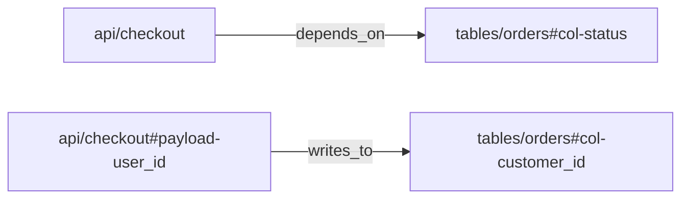

# okf

`okf` - CLI-toolkit для создания, проверки, анализа и экспорта
[Open Knowledge Format (OKF) v0.1](https://github.com/GoogleCloudPlatform/knowledge-catalog/blob/main/okf/SPEC.md),
открытого формата Google для представления знаний в виде дерева Markdown-файлов
с YAML frontmatter, удобного и людям, и агентам. Репозиторий также содержит
Go-библиотеку с минимальным числом зависимостей и portable agent skill для OKF
workflows.

Проект предоставляет четыре публичных способа использования:

1. CLI-toolkit `okf` для работы с OKF-bundle.
2. Go library packages `github.com/skosovsky/okf/bundle`, `github.com/skosovsky/okf/validator` и `github.com/skosovsky/okf/graph` для встраивания OKF в Go-программы.
3. Stdio MCP server `okf-mcp` для agent clients, которым нужно через tools
   читать, проверять, строить graph и безопасно редактировать локальные
   OKF-bundle.
4. Agent skill `open-knowledge-format` для консультаций, создания, конвертации,
   обогащения, проверки и экспорта OKF-bundle.

English documentation: [README.md](README.md).

## Способ 1: Toolkit

Установка команды `okf`:

```sh
go install github.com/skosovsky/okf/cmd/okf@latest
```

Проверка:

```sh
okf help
okf version
```

Основные команды:

```sh
okf validate -path <bundle>       # Проверить базовый OKF v0.1 conformance
okf validate -path <bundle> --strict --check-links --check-orphans
okf info     <bundle>       # Показать сводку по bundle
okf index    <bundle>       # Регенерировать index.md files
okf graph    <bundle>       # Экспортировать Markdown links и YAML relations
okf graph    <bundle> -format mermaid
okf graph    <bundle> -format json-ld
okf graph    <bundle> -format ntriples
okf graph    <bundle> --dot # Напечатать Graphviz DOT
okf parse    <file>         # Показать parsed structure одного документа
okf fmt      <file>         # Нормализовать документ в stdout
okf fmt      <file> -w      # Перезаписать файл на месте
```

Форматы вывода graph:

- `okf graph <bundle>` печатает default text adjacency list.
- `okf graph <bundle> -format dot` печатает Graphviz DOT. `--dot` остается legacy alias для этого формата.
- `okf graph <bundle> -format mermaid` печатает Mermaid flowchart syntax (`graph LR`), который можно вставить в Markdown code fence на платформах с Mermaid-rendering. Битые internal links выводятся пунктирными ребрами с меткой `404`.
- `okf graph <bundle> -format json-ld` печатает JSON-LD документ с `@context` и `@graph` для graph tooling и agent harnesses. Каждый concept выводится как узел `bundle:<id>` с `@type: "okf:Concept"`. Internal links выводятся как объекты `okf:Reference` с `target` и `exists`, поэтому dangling internal links остаются видимыми как `"exists": false`.
- `okf graph <bundle> -format ntriples` печатает line-oriented RDF/N-Triples: один full-IRI факт на строку для bulk load, shell processing, RDF tooling и streaming graph pipelines.

Semantic relations добавляют второй слой graph. Markdown links остаются human
navigation и экспортируются как `okf:references`; YAML `relations` задают
строгие semantic dependencies для impact analysis:

```yaml
type: API Endpoint
schema:
  fields:
    - id: payload-user_id
      name: user_id
      relations:
        writes_to:
          - target: tables/orders#col-customer_id
relations:
  depends_on:
    - target: tables/orders#col-status
```

Targets в `relations` - это OKF concept refs, а не Markdown paths: используй
`tables/orders#col-status`, а не `tables/orders.md#col-status`. Для nested
semantic sources нужен явный `id` или `anchor`; display `name` не
интерпретируется как anchor. `okf validate --check-links` по-прежнему проверяет
только Markdown links. Graph export сохраняет semantic edges даже если target
concept отсутствует.

Grammar relation ref: `<concept-id>[#<fragment>]`. Concept id должен точно
совпадать с bundle concept id: без leading `/`, `./`, `../`, `.md` suffix,
external URI scheme, empty path segment и пробелов по краям. Fragment - literal
subresource id: непустой, без пробелов по краям, без `#` и без ASCII control
characters. Invalid examples: `/tables/orders.md`, `tables/orders.md`,
`#local-section`, `https://example.com/orders`, `urn:orders`, `tables/orders#`,
`tables/orders#col#status`, `tables/orders# col-status`.



```json
{"@id":"bundle:api/checkout#payload-user_id","@type":"okf:SubResource","is_part_of":{"@id":"bundle:api/checkout"},"writes_to":[{"@id":"bundle:tables/orders#col-customer_id","exists":true}]}
```

```text
<local:bundle:api%2Fcheckout#payload-user_id> <https://okf.io/ontology/v0.1#writes_to> <local:bundle:tables%2Forders#col-customer_id> .
```

Для успешно разобранного validation invocation `okf validate` возвращает
non-zero exit status, если в bundle есть conformance errors. Поэтому команду
можно использовать напрямую в CI. CLI usage или flag errors тоже возвращают
`1`, но не печатают validation summary:

```sh
okf validate -path ./knowledge
```

Успешная проверка печатает детерминированные diagnostics и summary:

```text
Validating bundle: ./knowledge

---
Scanned 12 files.
Result: PASS (0 errors, 0 warnings, 0 info)
```

Findings перед summary печатаются с severity labels `[ERROR]`, `[WARN]` или
`[INFO]`.

### Режимы валидации

`okf validate` устроен слоями. Базовый слой conformance выполняется по
умолчанию; дополнительные флаги включают advisory-проверки для review workflows.

| Режим | Как включить | Diagnostics | Код выхода |
| --- | --- | --- | --- |
| Base conformance | по умолчанию | `[ERROR]` для hard OKF v0.1 violations | `1`, если есть хотя бы одна error |
| Strict guidance | `--strict` | `[WARN]` для recommended metadata и body conventions | остается `0`, если нет base errors |
| Link graph | `--check-links` | `[INFO]` для missing files, `[WARN]` для missing anchors | остается `0`, если нет base errors |
| Orphan coverage | `--check-orphans` | `[WARN]` для unlisted concepts, `[INFO]` для missing local indexes | остается `0`, если нет base errors |

Исключение: с `--check-orphans` пустой non-root local `index.md` трактуется как
поверхность orphan coverage и дает orphan warnings вместо empty-index structure
error.

Базовый слой проверяет UTF-8, frontmatter blocks у concepts, непустой string
`type`, структуру reserved `index.md` и `log.md`, а также
forward-compatible поведение для unknown frontmatter keys, unknown `type`
values и будущих `okf_version`.

`--strict` проверяет recommended fields `title`, `description`, `tags` и
`timestamp`; `tags` должен быть YAML list of strings, а `timestamp` должен
парситься как RFC3339. Также проверяются conventional `# Citations`,
`# Examples`, BigQuery `# Schema` и descriptions в `index.md`. Отсутствующий
`resource` намеренно не считается warning; если `resource` присутствует, он
должен быть валидным URI.

## Способ 2: Library

Добавление пакета в Go-модуль:

```sh
go get github.com/skosovsky/okf
```

Импорт:

```go
import (
	"github.com/skosovsky/okf/bundle"
	"github.com/skosovsky/okf/validator"
)
```

Валидация bundle:

```go
b, err := bundle.LoadBundle("./knowledge")
if err != nil {
	return err
}

report := validator.ValidateBundle(b, &validator.ValidatorConfig{
	Strict:       true,
	CheckLinks:   true,
	CheckOrphans: true,
})
if !report.IsConformant() {
	for _, diagnostic := range report.Of(validator.SeverityError) {
		fmt.Println(diagnostic)
	}
}
```

Парсинг одного документа:

```go
doc, err := bundle.ParseDocument(input)
if err != nil {
	return err
}

title, _ := doc.Frontmatter.Title()
links := doc.Links()
citations := doc.Citations()
```

Регенерация индексов из Go:

```go
written, err := bundle.RegenerateIndexes("./knowledge")
if err != nil {
	return err
}

fmt.Println(written)
```

## Способ 3: MCP Server

Установка команды `okf-mcp`:

```sh
go install github.com/skosovsky/okf/cmd/okf-mcp@latest
```

Настрой MCP client на запуск `okf-mcp` через stdio. Сервер предоставляет tools:

```json
{
  "mcpServers": {
    "okf": {
      "command": "okf-mcp"
    }
  }
}
```

`stdout` зарезервирован под MCP JSON-RPC protocol. Diagnostics и startup errors
пишутся в `stderr`.

- Перед изменением bundle получить контекст через `get_semantic_graph` и, если
  нужно, `read_concept`.
- `list_concepts` - загрузить bundle и вернуть детерминированный список concepts.
- `read_concept` - прочитать Markdown одного concept по canonical concept id.
- `validate_bundle` - вернуть JSON validation report.
- `get_semantic_graph` - вернуть тот же JSON-LD graph, что и `okf graph -format json-ld`.
- `write_concept` - создать или обновить один concept через staged strict validation, затем атомарно записать файл.

Все tools требуют absolute `bundle_path`. Concept tools используют canonical OKF
concept ids вроде `tables/orders`, без leading slash и без suffix `.md`.
Read/write paths отклоняют symlinks внутри bundle path. `write_concept`
проверяет временную staged copy со strict, link и orphan checks до изменения
реального bundle; rejected writes возвращают diagnostics и не меняют файлы. В
MCP-driven IDE workflow редактируй concepts через `write_concept`, не обходя
server прямыми filesystem writes.

## Способ 4: Agent Skill

В репозитории есть универсальный русскоязычный skill:
`skills/open-knowledge-format`. Используй его, когда агенту нужно:

- объяснить OKF concepts и правила conformance;
- спроектировать новый OKF bundle;
- конвертировать Markdown, Notion, Obsidian, CSV или spreadsheet материалы в OKF;
- обогатить existing OKF concepts metadata, sections `# Schema` и `# Examples`,
  citations, cross-links, indexes и logs;
- проверить OKF bundle через OKF CLI из Go module;
- работать с локальным OKF bundle через `okf-mcp`, если host поддерживает MCP
  tools;
- извлечь graph output для impact analysis и agent harnesses.

Для runtime, который поддерживает local skills, зарегистрируй или скопируй
директорию `skills/open-knowledge-format` с именем skill
`open-knowledge-format`. Skill не привязан к конкретному provider/runtime:
внутри только portable Markdown-инструкции и references.

Для установки как Codex plugin из этого репозитория используй включенный plugin
manifest `.codex-plugin/plugin.json` и repo-local marketplace manifest
`.agents/plugins/marketplace.json`:

```sh
codex plugin marketplace add .
codex plugin add okf@okf-local
```

После установки открой новую Codex-сессию и попроси использовать
`$open-knowledge-format`.

Для установки как Claude Code plugin из GitHub используй включенный Claude
plugin manifest `.claude-plugin/plugin.json` и marketplace manifest
`.claude-plugin/marketplace.json`:

```text
/plugin marketplace add skosovsky/okf
/plugin install okf@okf
/reload-plugins
```

После установки вызови `/okf:open-knowledge-format` или дай Claude Code
использовать skill автоматически, когда задача связана с OKF.

Для quality gate используй команду из Go module:

```sh
go run github.com/skosovsky/okf/cmd/okf@latest validate -path <bundle>
```

Этот же CLI умеет печатать summary, генерировать index, экспортировать graph,
парсить и форматировать documents:

```sh
go run github.com/skosovsky/okf/cmd/okf@latest validate -path <bundle>
go run github.com/skosovsky/okf/cmd/okf@latest info <bundle>
go run github.com/skosovsky/okf/cmd/okf@latest index <bundle>
go run github.com/skosovsky/okf/cmd/okf@latest graph <bundle>
go run github.com/skosovsky/okf/cmd/okf@latest graph <bundle> -format mermaid
go run github.com/skosovsky/okf/cmd/okf@latest graph <bundle> -format json-ld
go run github.com/skosovsky/okf/cmd/okf@latest graph <bundle> -format ntriples
```

Если `okf` уже установлен, `okf validate -path <bundle>` эквивалентен.

## OKF-документ

```markdown
---
type: BigQuery Table
title: Orders
description: One row per completed customer order.
tags: [sales, orders]
timestamp: 2026-05-28T00:00:00Z
---

# Schema

Part of the [sales dataset](/datasets/sales.md).

# Citations

[1] [Runbook](https://example.com/runbook)
```

## Что поддерживается

- Markdown-документы с YAML frontmatter.
- Валидация concept ID и сопоставление с путями.
- Загрузка bundle из дерева директорий.
- Извлечение Markdown-ссылок и citations.
- Graph output для Markdown links и YAML semantic relations.
- Backlinks и отчет о broken links.
- Conformance validation для OKF v0.1.
- Детерминированная генерация `index.md`.
- Парсинг и рендеринг `log.md`.

## Валидация

Conformance validation следует правилам OKF v0.1 и сознательно не переносит
семантическую экспертизу в Go validation layer. Поиск claims, оценка
репрезентативности `type`, стиль текста, генерация контента и исправление
ссылок остаются задачей агента или кастомной политики, а не базового
conformance.

Для CI-gate используй default mode. Для review workflows добавляй `--strict`,
`--check-links` и `--check-orphans`: warnings и informational diagnostics
становятся видимыми, но сами по себе не отклоняют bundle.

## Разработка

Запуск тестов:

```sh
go test ./...
```

Проверка покрытия:

```sh
go test -coverprofile=/tmp/okf-cover.out ./...
go tool cover -func=/tmp/okf-cover.out
```
