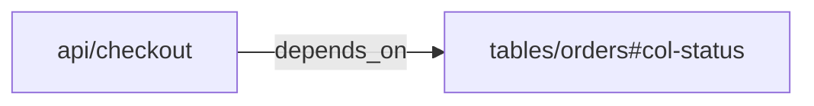



# Toolkit

`okf` - Go CLI в `cmd/okf`: toolkit для создания, проверки, анализа и экспорта
Open Knowledge Format bundles. Это deterministic surface для repo-local skill и
CI workflows.

## Запуск из репозитория

```sh
go run ./cmd/okf validate -path ./knowledge
go run ./cmd/okf info ./knowledge
go run ./cmd/okf index ./knowledge
go run ./cmd/okf graph ./knowledge -format json-ld
go run ./cmd/okf parse ./knowledge/concept.md
go run ./cmd/okf fmt ./knowledge/concept.md
```

Установка для повторного использования:

```sh
go install ./cmd/okf
okf validate -path ./knowledge
okf graph ./knowledge -format mermaid
```

## Pipeline

| Stage | Команда | Назначение |
| --- | --- | --- |
| Quality Gate | `okf validate -path <bundle>` | Проверить OKF v0.1 conformance и optional review signals. |
| Bundle Summary | `okf info <bundle>` | Сводка по concepts, types, links, reserved files и version. |
| Index Maintenance | `okf index <bundle>` | Регенерировать local `index.md` disclosure surfaces. |
| Graph Export | `okf graph <bundle>` | Экспортировать Markdown links и YAML semantic `relations`. |
| Document IO | `okf parse <file>`, `okf fmt <file>` | Проверить или нормализовать один concept document. |

## Quality Gate

`okf validate` - deterministic layered harness. Output намеренно остается
plain text с явными labels `[ERROR]`, `[WARN]` и `[INFO]`, чтобы агенты и CI
могли парсить его без угадывания.

| Слой | Как включить | Что проверяет | Diagnostic level |
| --- | --- | --- | --- |
| Base conformance | по умолчанию | UTF-8, concept frontmatter blocks, непустой string `type`, reserved `index.md`/`log.md`, forward compatibility | `[ERROR]` |
| Strict guidance | `--strict` | recommended metadata, RFC3339 timestamps, conventional sections, citations, examples, BigQuery schema, index descriptions | `[WARN]` |
| Link graph | `--check-links` | bundle-relative и relative Markdown links, target files, heading anchors | `[INFO]` для missing files, `[WARN]` для missing anchors |
| Orphan coverage | `--check-orphans` | покрытие concept files локальным `index.md` | `[WARN]` для orphans, `[INFO]` для missing local indexes |

Для успешно разобранного validation invocation report возвращает non-zero exit
status тогда и только тогда, когда содержит diagnostics уровня `[ERROR]`.
Warnings и info - видимые review-сигналы; они не делают bundle non-conformant.
CLI usage/flag errors тоже возвращают `1`, но печатают `error:` без validation
summary.

### Base conformance

Базовый слой по умолчанию представляет strict OKF v0.1 conformance:

1. Каждый Markdown-файл должен быть valid UTF-8.
2. Каждый non-reserved concept `.md` file должен начинаться с YAML frontmatter
   block, отделенного строками `---`.
3. Каждый concept frontmatter должен содержать непустой string `type`.
4. `log.md` должен использовать level-2 headings `## YYYY-MM-DD`, newest first,
   со списком entries под каждой датой.
5. `index.md` не должен иметь frontmatter, кроме root `okf_version`; body должен
   использовать headings и Markdown list entries со ссылками.
6. Unknown frontmatter keys, unknown `type` values и будущие `okf_version`
   принимаются для forward compatibility.

Исключение: когда включен `--check-orphans`, пустой non-root local `index.md`
допускается как поверхность orphan coverage и дает orphan warnings вместо base
empty-index error.

### Strict guidance

`--strict` проверяет SHOULD и Recommended guidance из стандарта. Он генерирует
warnings, а не conformance errors:

1. `title`, `description`, `tags` и `timestamp` должны присутствовать.
2. `tags`, если присутствует, должен быть YAML list of strings.
3. `timestamp`, если присутствует, должен парситься как `time.RFC3339`.
4. `resource` намеренно optional. Отсутствующий `resource` не дает warning;
   присутствующий `resource` должен быть URI string.
5. Citation markers вида `[1]` требуют нижнюю секцию `# Citations` с
   непрерывной нумерацией entries. Citation targets должны быть valid URIs,
   bundle-absolute paths или paths under `references/`.
6. `# Examples` должен содержать concrete example content: code block, list,
   table, link или substantive prose.
7. Concepts с `type: BigQuery Table` должны иметь `# Schema`.
8. Descriptions в entries `index.md` должны совпадать с `description`
   целевого concept, если это поле есть.

## Bundle Summary

`okf info <bundle>` загружает bundle и печатает deterministic counts: bundle
root, optional `okf_version`, concepts, local indexes, logs, type distribution,
internal links, broken links и unparseable files.

Используй это, когда агенту или reviewer нужен быстрый inventory перед чтением
глубоких concept files.

## Index Maintenance

`okf index <bundle>` регенерирует `index.md` files из concept metadata. Используй
после создания, перемещения или enrichment concept documents, чтобы
directory-level progressive disclosure оставался актуальным.

## Graph Export

```text
okf graph <bundle>
okf graph <bundle> -format dot
okf graph <bundle> -format mermaid
okf graph <bundle> -format json-ld
okf graph <bundle> -format ntriples
okf graph <bundle> --dot
```

`okf graph` поддерживает пять форматов вывода. Default `text` format - компактный
adjacency list для просмотра в терминале. `-format dot` выводит Graphviz DOT
для Graphviz-based tooling; `--dot` сохранен как legacy alias. `-format
mermaid` выводит Mermaid flowchart syntax со строкой `graph LR`, пригодный для
Markdown renderers с поддержкой Mermaid. Битые internal Markdown links
отображаются пунктирными ребрами с меткой `404`.

`-format json-ld` выводит JSON-LD документ с `@context` и `@graph` для graph
tooling и agent harnesses: concepts становятся узлами `bundle:<id>` с
`@type: "okf:Concept"`, а internal Markdown links становятся объектами
`okf:Reference` с `target` и `exists`. JSON-LD graph сохраняет dangling
internal links как `"exists": false`.

`-format ntriples` выводит line-oriented RDF/N-Triples с full IRIs и одним
фактом на строку для streaming workflows, bulk-load pipelines, RDF tooling и
shell processing.

Graph output имеет два слоя:

- Markdown links - human navigation и экспортируются как `okf:references`.
- YAML `relations` - semantic dependency edges для impact analysis.

```yaml
type: API Endpoint
schema:
  fields:
    - id: payload-user_id
      relations:
        writes_to:
          - target: tables/orders#col-customer_id
relations:
  depends_on:
    - target: tables/orders#col-status
```

Targets в `relations` - это OKF concept refs, а не Markdown paths. Используй
`tables/orders#col-status`; не используй `tables/orders.md#col-status`.
Для nested sources нужен явный `id` или `anchor`; `name` - только display
metadata. `okf validate --check-links` не проверяет semantic relations, missing
semantic targets и target fragments. Graph export сохраняет semantic edges,
даже если target concept отсутствует.

Grammar relation ref: `<concept-id>[#<fragment>]`. Concept id должен точно
совпадать с bundle concept id: без leading `/`, `./`, `../`, `.md` suffix,
external URI scheme, empty path segment и пробелов по краям. Fragment - literal
subresource id: непустой, без пробелов по краям, без `#` и без ASCII control
characters. Invalid examples: `/tables/orders.md`, `tables/orders.md`,
`#local-section`, `https://example.com/orders`, `urn:orders`, `tables/orders#`,
`tables/orders#col#status`, `tables/orders# col-status`.



```json
{"@id":"bundle:api/checkout","depends_on":[{"@id":"bundle:tables/orders#col-status","exists":true}]}
```

```text
<local:bundle:api%2Fcheckout> <https://okf.io/ontology/v0.1#depends_on> <local:bundle:tables%2Forders#col-status> .
```

## Document IO

`okf parse <file>` печатает parsed structure одного concept document. Используй
это для debugging frontmatter/body parsing без загрузки полного bundle.

`okf fmt <file>` нормализует один document в stdout. `okf fmt <file> -w`
перезаписывает его на месте.

## Вне scope

Go quality gate не делает semantic/editorial judgments. Поиск claims,
репрезентативность `type`, стиль текста, генерация контента и исправление
ссылок делегируются агентам, skills или кастомным policy.
