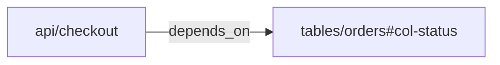



# Toolkit

`okf` - Go CLI в `cmd/okf`: toolkit для создания, проверки, анализа и экспорта
Open Knowledge Format bundles. Это deterministic surface для repo-local skill и
CI workflows.

## Запуск из репозитория

```sh
go run ./cmd/okf validate -path ./knowledge
go run ./cmd/okf info ./knowledge
go run ./cmd/okf index ./knowledge
go run ./cmd/okf graph ./knowledge -format json-ld
go run ./cmd/okf parse ./knowledge/concept.md
go run ./cmd/okf fmt ./knowledge/concept.md
```

Установка для повторного использования:

```sh
go install ./cmd/okf
okf validate -path ./knowledge
okf graph ./knowledge -format mermaid
```

## Pipeline

| Stage | Команда | Назначение |
| --- | --- | --- |
| Quality Gate | `okf validate -path <bundle>` | Проверить OKF v0.1 conformance и optional review signals. |
| Bundle Summary | `okf info <bundle>` | Сводка по concepts, types, links, reserved files и version. |
| Index Maintenance | `okf index <bundle>` | Регенерировать local `index.md` disclosure surfaces. |
| Graph Export | `okf graph <bundle>` | Экспортировать Markdown links и YAML semantic `relations`. |
| Document IO | `okf parse <file>`, `okf fmt <file>` | Проверить или нормализовать один concept document. |

## Quality Gate

`okf validate` - deterministic layered harness. Output намеренно остается
plain text с явными labels `[ERROR]`, `[WARN]` и `[INFO]`, чтобы агенты и CI
могли парсить его без угадывания.

| Слой | Как включить | Что проверяет | Diagnostic level |
| --- | --- | --- | --- |
| Base conformance | по умолчанию | UTF-8, concept frontmatter blocks, непустой string `type`, reserved `index.md`/`log.md`, forward compatibility | `[ERROR]` |
| Strict guidance | `--strict` | recommended metadata, RFC3339 timestamps, conventional sections, citations, examples, BigQuery schema, index descriptions | `[WARN]` |
| Link graph | `--check-links` | bundle-relative и relative Markdown links, target files, heading anchors | `[INFO]` для missing files, `[WARN]` для missing anchors |
| Orphan coverage | `--check-orphans` | покрытие concept files локальным `index.md` | `[WARN]` для orphans, `[INFO]` для missing local indexes |

Semantic relation diagnostics сохраняются для graph и mutation workflows, но не
являются слоем CLI validation. `--strict` и `--check-links` не меняют эту
политику. Go-клиент может включить их через `ValidatorConfig.CheckRelations`;
mutation и write paths независимо отклоняют blocking relation diagnostics.

Для успешно разобранного validation invocation report возвращает non-zero exit
status тогда и только тогда, когда содержит diagnostics уровня `[ERROR]`.
Warnings и info - видимые review-сигналы; они не делают bundle non-conformant.
CLI usage/flag errors тоже возвращают `1`, но печатают `error:` без validation
summary.

### Base conformance

Базовый слой по умолчанию представляет strict OKF v0.1 conformance:

1. Каждый Markdown-файл должен быть valid UTF-8.
2. Каждый non-reserved concept `.md` file должен начинаться с YAML frontmatter
   block, отделенного строками `---`.
3. Каждый concept frontmatter должен содержать непустой string `type`.
4. `log.md` должен использовать level-2 headings `## YYYY-MM-DD`, newest first,
   со списком entries под каждой датой.
5. `index.md` не должен иметь frontmatter, кроме root `okf_version`; body должен
   использовать headings и Markdown list entries со ссылками.
6. Unknown frontmatter keys, unknown `type` values и будущие `okf_version`
   принимаются для forward compatibility.

Исключение: когда включен `--check-orphans`, пустой non-root local `index.md`
допускается как поверхность orphan coverage и дает orphan warnings вместо base
empty-index error.

### Strict guidance

`--strict` проверяет SHOULD и Recommended guidance из стандарта. Он генерирует
warnings, а не conformance errors:

1. `title`, `description`, `tags` и `timestamp` должны присутствовать.
2. `tags`, если присутствует, должен быть YAML list of strings.
3. `timestamp`, если присутствует, должен парситься как `time.RFC3339`.
4. `resource` намеренно optional. Отсутствующий `resource` не дает warning;
   присутствующий `resource` должен быть URI string.
5. Citation markers вида `[1]` требуют нижнюю секцию `# Citations` с
   непрерывной нумерацией entries. Citation targets должны быть valid URIs,
   bundle-absolute paths или paths under `references/`.
6. `# Examples` должен содержать concrete example content: code block, list,
   table, link или substantive prose.
7. Concepts с `type: BigQuery Table` должны иметь `# Schema`.
8. Descriptions в entries `index.md` должны совпадать с `description`
   целевого concept, если это поле есть.

## Bundle Summary

`okf info <bundle>` загружает bundle и печатает deterministic counts: bundle
root, optional `okf_version`, concepts, local indexes, logs, type distribution,
internal links, broken links и unparseable files.

Используй это, когда агенту или reviewer нужен быстрый inventory перед чтением
глубоких concept files.

## Index Maintenance

`okf index <bundle>` регенерирует `index.md` files из concept metadata. Используй
после создания, перемещения или enrichment concept documents, чтобы
directory-level progressive disclosure оставался актуальным.

## Graph Export

```text
okf graph <bundle>
okf graph <bundle> -format dot
okf graph <bundle> -format mermaid
okf graph <bundle> -format json-ld
okf graph <bundle> -format ntriples
okf graph <bundle> --dot
```

`okf graph` поддерживает пять форматов вывода. Default `text` format - компактный
adjacency list для просмотра в терминале. `-format dot` выводит Graphviz DOT
для Graphviz-based tooling; `--dot` сохранен как legacy alias. `-format
mermaid` выводит Mermaid flowchart syntax со строкой `graph LR`, пригодный для
Markdown renderers с поддержкой Mermaid. Битые internal Markdown links
отображаются пунктирными ребрами с меткой `404`.

`-format json-ld` выводит JSON-LD документ с `@context` и `@graph` для graph
tooling и agent harnesses: concepts становятся узлами `bundle:<id>` с
`@type: "okf:Concept"`, а internal Markdown links становятся объектами
`okf:Reference` с `target` и `exists`. JSON-LD graph сохраняет dangling
internal links как `"exists": false`.

`-format ntriples` выводит line-oriented RDF/N-Triples с full IRIs и одним
фактом на строку для streaming workflows, bulk-load pipelines, RDF tooling и
shell processing.

Graph output имеет два слоя:

- Markdown links - human navigation и экспортируются как `okf:references`.
- YAML `relations` - semantic dependency edges для impact analysis.

```yaml
type: API Endpoint
schema:
  fields:
    - id: payload-user_id
      relations:
        writes_to:
          - target: tables/orders#col-customer_id
relations:
  depends_on:
    - target: tables/orders#col-status
```

Targets в `relations` - это OKF concept refs, а не Markdown paths. Используй
`tables/orders#col-status`; не используй `tables/orders.md#col-status`.
Для nested sources нужен явный `id` или `anchor`; `name` - только display
metadata. `okf validate --check-links` проверяет только Markdown links.
Некорректные или неразрешенные semantic relations остаются structured
diagnostics: они исключаются из resolved outgoing, incoming и reverse indexes,
а также из всех semantic graph exporters. Dangling Markdown links — отдельный
навигационный слой и могут по-прежнему отображаться как missing.

Grammar relation ref: `<concept-id>[#<fragment>]`. Concept id должен точно
совпадать с bundle concept id: без leading `/`, `./`, `../`, `.md` suffix,
external URI scheme, empty path segment и пробелов по краям. Fragment - literal
subresource id: непустой, без пробелов по краям, без `#` и без ASCII control
characters. Invalid examples: `/tables/orders.md`, `tables/orders.md`,
`#local-section`, `https://example.com/orders`, `urn:orders`, `tables/orders#`,
`tables/orders#col#status`, `tables/orders# col-status`.


```mermaid
graph LR
  n0["api/checkout"] -->|"depends_on"| n1["tables/orders#col-status"]
```

```json
{"@id":"bundle:api/checkout","depends_on":[{"@id":"bundle:tables/orders#col-status","exists":true}]}
```

```text
<local:bundle:api%2Fcheckout> <https://okf.io/ontology/v0.1#depends_on> <local:bundle:tables%2Forders#col-status> .
```

## Document IO

`okf parse <file>` печатает parsed structure одного concept document. Используй
это для debugging frontmatter/body parsing без загрузки полного bundle.

`okf fmt <file>` нормализует один document в stdout. `okf fmt <file> -w`
перезаписывает его на месте.

## Transactional mutation API

Go library package `store` определяет immutable `Snapshot`, versioned
`ChangeSet`, `Preview` и `Commit`; `store/fs` реализует durable commits для
одного local filesystem. Revision — algorithm-qualified digest от canonical
sorted manifest. По умолчанию это `sha256:<lowercase-hex>`;
`fs.Config.HashAlgorithm` может заменить алгоритм. Revision-visible set —
каждый regular file под bundle root, включая non-Markdown files и reserved
index/log files, кроме `.okf/**`. Symlinks никогда не читаются и не хешируются;
internal journal, receipts и lease исключены. Journal v5 фиксирует алгоритм и
canonical request/result/replay data в compact bounded manifest; durable staged
payloads содержат post-state bytes. Перед apply или recovery каждый payload
проверяется по safe no-follow path, declared size и SHA-256 digest. Затем
recovery очищает transaction и stage и требует ту же configured algorithm.
Persisted receipt envelope использует v2.

```go
package example

import (
	"context"
	"errors"
	"fmt"

	"github.com/skosovsky/okf/bundle"
	"github.com/skosovsky/okf/store"
	"github.com/skosovsky/okf/store/fs"
)

func update(ctx context.Context) (err error) {
	s, err := fs.Open("./knowledge", fs.DefaultConfig())
	if err != nil { return err }
	defer func() { if closeErr := s.Close(); closeErr != nil && err == nil { err = closeErr } }()
	base, err := s.Snapshot(ctx)
	if err != nil { return err }
	source, err := bundle.ParseRelationRef("api/orders")
	if err != nil { return err }
	target, err := bundle.ParseRelationRef("tables/orders")
	if err != nil { return err }
	change := store.ChangeSet{Version: store.ChangeSetFormatVersion, ID: "add-order-dependency", Actor: "agent", BaseRevision: base.Revision(), Operations: []store.Operation{store.EnsureRelation{Source: source, Type: "depends_on", Target: target}}}
	preview, err := s.Preview(ctx, change)
	if err != nil { return err }
	_ = preview
	_, err = s.Commit(ctx, change, store.CommitOptions{IdempotencyKey: "request-42"})
	var conflict *store.Conflict
	if errors.As(err, &conflict) { return fmt.Errorf("refresh and retry from %s", conflict.Actual) }
	return err
}
```

`EnsureRelation` имеет desired-state semantics: оставляет semantic edge ровно
один раз. `MoveConcept` переносит concept и переписывает statically resolvable
canonical references. `RenameFragment` переименовывает один явный unique
fragment и его incoming canonical references. Ref с fragment существует, только
если существуют concept и один unique matching fragment.

Fragments определяют только nested mapping; top-level frontmatter `id` и
`anchor` — metadata concept. `id` — canonical identity fragment для nested mapping. Если валидный `anchor`
отличается, это noncanonical alias для информации и навигации; semantic
mutations и relation refs адресуют canonical `id`.

`Preview` строит и валидирует staged state без записи. `Commit` повторно сверяет
base revision под advisory lease cooperating writers; changed base возвращает
`*store.Conflict`, распознаваемый через `errors.As`. Idempotency receipts
привязаны к canonical versioned request digest: `Commit` возвращает
`store.CommitReceipt`, а `ReplaceConcept` возвращает его в result; оба replay
идентичный receipt для того же key и request, другой request —
`*store.IdempotencyConflict`. По умолчанию receipts
хранятся 24 часа и никогда не меньше 1000 самых новых.

Гарантии ограничены одним filesystem. Locks advisory, поэтому raw editors не
координируются; raw readers могут увидеть multi-file rename во время публикации.
Journal гарантирует recovery, а не distributed isolation. Для distributed
deployments нужен другой `store.Store` backend.

`write_concept` в `okf-mcp` делает staged strict/link/orphan validation и
использует этот durable cooperating-writer commit path. Distributed locking и
isolation от raw filesystem edits он не обещает. Server-side idempotency
identity выводится из canonical write request, поэтому идентичный MCP retry не
публикует повторно. Fixed success response остаётся `status`, `path` и
`diagnostics`; MCP не раскрывает receipt DTO или commit evidence.

### Lossless parser-backed edits

Planning идет по one-load staged-validation path: validation завершается до
filesystem write, а invalid, unsupported или ambiguous mutation не создает
partial staged result. CLI и MCP wire schemas не меняются.

Markdown destinations доказываются Goldmark semantic parser'ом и отдельным
exact byte-span collector. Parser видит только body, а collector отображает
spans в полный source file. Eligible — inline links, images и destination
reference definition; definition patch'ится один раз независимо от use sites.
Duplicate normalized definitions дают Ambiguous. Escapes и entities декодируются
для semantic matching; replacement сохраняет angle style или использует
безопасный escaped angle form. Autolinks и raw HTML намеренно исключены. AST re-render отсутствует: bytes вне
доказанных spans остаются byte-identical.

Для frontmatter `yaml.v3` — semantic authority. Resolver допускает только
documented block-style subset и доказывает raw bytes каждого touched plain,
single-quoted или double-quoted scalar key и value. Invalid UTF-8, unsupported syntax и
несколько candidate spans fail-closed как inspectable
`mutation.PresentationError` с `ErrUnsupportedPresentation` или
`ErrAmbiguousPresentation`; goccy и tree-sitter не являются dependencies.

Flat `mutation.Overlay` shallow-share'ит immutable staged payloads, хранит
manifest delta над immutable base, отдает defensive reads и заполняет общий
cache `Paths` только после successful enumeration. Parent chain и HAMT
намеренно отсутствуют. `bundle.SourceFromFS(fsys fs.FS)` — non-owning adapter
к core `bundle.Source`; caller обязан передать stable filesystem snapshot на
весь срок использования.

Точная граница: parsing идёт только по body, offsets отображаются в полный
файл. Переписываются лишь Goldmark AST inline links/images и reference
definitions; semantic link/image внутри inline-HTML container остаётся eligible,
когда Goldmark создаёт `Link`/`Image`. Autolinks, raw-HTML `href`/URLs, code
spans, fenced/indented code и unresolved/malformed references исключены.
Touched YAML fail-closed для flow mapping/sequence, literal/folded block scalar,
explicit/custom tag, direct anchor или complex key (Unsupported); alias/merge
provenance и duplicate semantic relations/type/target/id/anchor (Ambiguous);
остальные duplicate touched mapping keys (Unsupported); `%YAML`/`%TAG`, inner
document/end markers или multidoc frontmatter и unprovable comment/range;
unrelated nonintersecting extension bytes могут остаться. Invalid UTF-8 и все
unsupported/ambiguous случаи возвращают typed error и не создают stage. YAML
задают только recognized outer frontmatter delimiters; body thematic `---` и
setext underline — Markdown, не YAML multi-doc.

## Вне scope

Go quality gate не делает semantic/editorial judgments. Поиск claims,
репрезентативность `type`, стиль текста, генерация контента и исправление
ссылок делегируются агентам, skills или кастомным policy.

Filesystem store contract: `MaxStagedFiles` по умолчанию и максимум 100 000 (`payload-00000`…`payload-99999`); case-folding и Unicode-normalization capabilities проверяются независимо. `.okf` directories no-follow 0700, private files и lease 0600 либо fail-closed.
