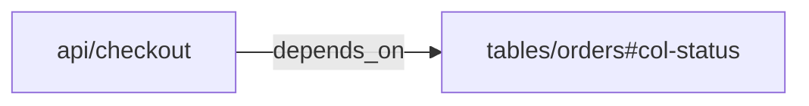



# Toolkit

`okf` is the Go CLI in `cmd/okf`: a command-line toolkit for building,
validating, analyzing, and exporting Open Knowledge Format bundles. It is the
deterministic surface used by the repo-local skill and by CI workflows.

## Run from the repository

```sh
go run ./cmd/okf validate -path ./knowledge
go run ./cmd/okf info ./knowledge
go run ./cmd/okf index ./knowledge
go run ./cmd/okf graph ./knowledge -format json-ld
go run ./cmd/okf parse ./knowledge/concept.md
go run ./cmd/okf fmt ./knowledge/concept.md
```

Install it for repeated use:

```sh
go install ./cmd/okf
okf validate -path ./knowledge
okf graph ./knowledge -format mermaid
```

## Pipeline

| Stage | Command | Purpose |
| --- | --- | --- |
| Quality Gate | `okf validate -path <bundle>` | Check OKF v0.1 conformance and optional review signals. |
| Bundle Summary | `okf info <bundle>` | Summarize concepts, types, links, reserved files, and version. |
| Index Maintenance | `okf index <bundle>` | Regenerate local `index.md` disclosure surfaces. |
| Graph Export | `okf graph <bundle>` | Export Markdown links and YAML semantic `relations`. |
| Document IO | `okf parse <file>`, `okf fmt <file>` | Inspect or normalize one concept document. |

## Quality Gate

`okf validate` is a deterministic, layered harness. Its output is intentionally
plain text with explicit `[ERROR]`, `[WARN]`, and `[INFO]` labels so agents and
CI jobs can parse it without guessing.

| Layer | Enable with | What it checks | Diagnostic level |
| --- | --- | --- | --- |
| Base conformance | default | UTF-8, concept frontmatter blocks, non-empty string `type`, reserved `index.md`/`log.md`, forward compatibility | `[ERROR]` |
| Strict guidance | `--strict` | recommended metadata, RFC3339 timestamps, conventional sections, citations, examples, BigQuery schema, index descriptions | `[WARN]` |
| Link graph | `--check-links` | bundle-relative and relative Markdown links, target files, heading anchors | `[INFO]` for missing files, `[WARN]` for missing anchors |
| Orphan coverage | `--check-orphans` | local `index.md` coverage for concept files | `[WARN]` for orphans, `[INFO]` for missing local indexes |

For a successfully parsed validation invocation, the report exit code is
non-zero if and only if it contains `[ERROR]` diagnostics. Warnings and info are
visible review signals; they do not make a bundle non-conformant. CLI
usage/flag errors also return `1`, but print `error:` without a validation
summary.

### Base conformance

The default base layer represents strict OKF v0.1 conformance:

1. Every Markdown file must be valid UTF-8.
2. Every non-reserved concept `.md` file must start with a YAML frontmatter
   block delimited by `---` lines.
3. Every concept frontmatter must contain a non-empty string `type`.
4. `log.md` must use level-2 `## YYYY-MM-DD` date headings, newest first, with
   list entries under each date.
5. `index.md` must not contain frontmatter except for root `okf_version`; its
   body must use headings and Markdown list entries with links.
6. Unknown frontmatter keys, unknown `type` values, and future `okf_version`
   values are accepted for forward compatibility.

Exception: when `--check-orphans` is enabled, an empty non-root local `index.md`
is tolerated as an orphan-coverage surface and reports orphan warnings instead
of a base empty-index error.

### Strict guidance

`--strict` checks the standard's SHOULD and Recommended guidance. It emits
warnings, not conformance errors:

1. `title`, `description`, `tags`, and `timestamp` should be present.
2. `tags`, when present, must be a YAML list of strings.
3. `timestamp`, when present, must parse as `time.RFC3339`.
4. `resource` is intentionally optional. Missing `resource` is not a warning;
   present `resource` values should be URI strings.
5. Citation markers such as `[1]` require a bottom `# Citations` section with
   contiguous numbered entries. Citation targets must be valid URIs,
   bundle-absolute paths, or paths under `references/`.
6. `# Examples` should contain concrete example content, such as a code block,
   list, table, link, or substantive prose.
7. `type: BigQuery Table` concepts should include `# Schema`.
8. `index.md` entry descriptions should match the target concept
   `description` when that field exists.

## Bundle Summary

`okf info <bundle>` loads the bundle and prints deterministic counts: bundle
root, optional `okf_version`, concepts, local indexes, logs, type distribution,
internal links, broken links, and unparseable files.

Use it when an agent or reviewer needs a fast inventory before reading deeper
concept files.

## Index Maintenance

`okf index <bundle>` regenerates `index.md` files from concept metadata. Use it
after creating, moving, or enriching concept documents so directory-level
progressive disclosure stays current.

## Graph Export

```text
okf graph <bundle>
okf graph <bundle> -format dot
okf graph <bundle> -format mermaid
okf graph <bundle> -format json-ld
okf graph <bundle> -format ntriples
okf graph <bundle> --dot
```

`okf graph` supports five output formats. The default `text` format is a
compact adjacency list for terminal inspection. `-format dot` emits Graphviz DOT
for Graphviz-based tooling; `--dot` is kept as a legacy alias. `-format
mermaid` emits Mermaid flowchart syntax beginning with `graph LR`, suitable for
Markdown renderers that support Mermaid. Broken internal Markdown links are
shown as dotted edges labeled `404`.

`-format json-ld` emits a JSON-LD document with `@context` and `@graph` for
graph tooling and agent harnesses: concepts become `bundle:<id>` nodes with
`@type: "okf:Concept"`, and internal Markdown links become `okf:Reference`
objects with `target` and `exists`. The JSON-LD graph keeps dangling internal
links as `"exists": false`.

`-format ntriples` emits line-oriented RDF/N-Triples with full IRIs and one
fact per line for streaming workflows, bulk-load pipelines, RDF tooling, and
shell processing.

Graph output has two layers:

- Markdown links are human navigation and export as `okf:references`.
- YAML `relations` are semantic dependency edges for impact analysis.

```yaml
type: API Endpoint
schema:
  fields:
    - id: payload-user_id
      relations:
        writes_to:
          - target: tables/orders#col-customer_id
relations:
  depends_on:
    - target: tables/orders#col-status
```

Relation targets are OKF concept refs, not Markdown paths. Use
`tables/orders#col-status`; do not use `tables/orders.md#col-status`.
Nested sources require explicit `id` or `anchor`; `name` is display metadata
only. `okf validate --check-links` does not validate semantic relations,
missing semantic targets, or target fragments. Graph export preserves semantic
edges even when the target concept is missing.

Relation ref grammar is `<concept-id>[#<fragment>]`. The concept id must match
the bundle concept id exactly: no leading `/`, `./`, `../`, `.md` suffix,
external URI scheme, empty path segment, or surrounding whitespace. Fragments
are literal subresource ids: non-empty, no surrounding whitespace, no `#`, and
no ASCII control characters. Invalid examples include `/tables/orders.md`,
`tables/orders.md`, `#local-section`, `https://example.com/orders`,
`urn:orders`, `tables/orders#`, `tables/orders#col#status`, and
`tables/orders# col-status`.



```json
{"@id":"bundle:api/checkout","depends_on":[{"@id":"bundle:tables/orders#col-status","exists":true}]}
```

```text
<local:bundle:api%2Fcheckout> <https://okf.io/ontology/v0.1#depends_on> <local:bundle:tables%2Forders#col-status> .
```

## Document IO

`okf parse <file>` prints one concept document's parsed structure. Use it for
debugging frontmatter/body parsing without loading a full bundle.

`okf fmt <file>` normalizes one document to stdout. `okf fmt <file> -w`
rewrites it in place.

## Out of scope

The Go quality gate does not make semantic or editorial judgments. Claim
discovery, type representativeness, writing style, content generation, and link
repair are delegated to agents, skills, or custom policies.
